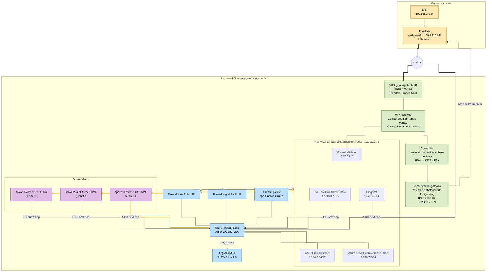

# ZA-East network topology (southafricanorth)

Subscription `29df7078-…` · Resource group `za-east-southafricanorth`. Shows the
hub-and-spoke network, Azure Firewall Basic, the route-based VPN gateway, and the
site-to-site IPsec tunnel to the on-premises FortiGate.



## Resource inventory

| Resource | Type | Key detail |
|---|---|---|
| `za-east-southafricanorth-vnet` | Virtual network | Hub `10.20.0.0/16` |
| `GatewaySubnet` | Subnet | `10.20.0.0/24` — hosts VPN gateway |
| `ZA-East-Hub` | Subnet | `10.20.1.0/24` + default NSG |
| `AzureFirewallSubnet` | Subnet | `10.20.6.64/26` |
| `AzureFirewallManagementSubnet` | Subnet | `10.20.7.0/24` |
| `Ping-test` | Subnet | `10.20.8.0/24` |
| `za-east-spoke-1/2/3-vnet` | Virtual networks | `10.21/22/23.0.0/24`, peered to hub |
| `AzFW-ZA-East-vDC` | Azure Firewall Basic | Data + mgmt public IPs, policy |
| `AzFW-Basic-LA` | Log Analytics workspace | Firewall diagnostics |
| `za-east-southafricanorth-vpngw` | VPN gateway | Basic, RouteBased, Gen1 |
| `za-east-southafricanorth-vpngw-pip` | Public IP | `20.87.106.128`, Standard, zones 1/2/3 |
| `za-east-southafricanorth-fortigate-lng` | Local network gateway | `169.0.216.146`, `192.168.2.0/24` |
| `za-east-southafricanorth-to-fortigate` | Connection | IPsec, IKEv2, PSK |
| On-prem FortiGate | External device | `wan2` = `169.0.216.146`, LAN int `b` |
```
