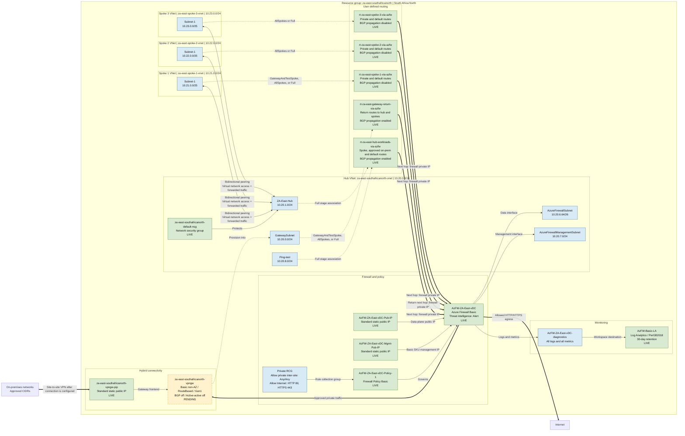

# ZA-East Network Architecture

## Scope

| Item | Value |
| --- | --- |
| Subscription | `ME-MngEnvMCAP056429-Connectivity` |
| Subscription ID | `29df7078-c53c-4638-81c1-e4bc8566d423` |
| Resource group | `za-east-southafricanorth` |
| Region | `southafricanorth` |
| Source | Live top-level Azure inventory plus validated Bicep relationships |

The resource group implements a hub-and-spoke network secured by Azure Firewall Basic. Three spoke VNets and two hub workload subnets use route tables whose next hop is the firewall private IP. A route-based VPN gateway is defined for `GatewaySubnet`; its public IP currently exists, but the gateway itself was not present in the live top-level inventory at diagram generation time.

Solid green nodes are live top-level resources. Blue nodes are subnet or policy components declared by the validated Bicep deployment. The dashed yellow VPN gateway is pending. Dashed route-table links are conditional associations controlled by `deploymentStage`.

## Logical Architecture

## Resource Inventory

| Resource | Type | Key relationship | Status |
| --- | --- | --- | --- |
| `za-east-southafricanorth-vnet` | Virtual network | Hub, `10.20.0.0/16`, five subnets | Live |
| `za-east-spoke-1-vnet` | Virtual network | Spoke 1, `10.21.0.0/24` | Live |
| `za-east-spoke-2-vnet` | Virtual network | Spoke 2, `10.22.0.0/24` | Live |
| `za-east-spoke-3-vnet` | Virtual network | Spoke 3, `10.23.0.0/24` | Live |
| `za-east-southafricanorth-default-nsg` | Network security group | Attached to `ZA-East-Hub` | Live |
| `za-east-southafricanorth-vpngw-pip` | Public IP address | Frontend for the planned VPN gateway | Live |
| `za-east-southafricanorth-vpngw` | Virtual network gateway | `Basic` non-AZ, route-based, `GatewaySubnet` | Pending |
| `AzFW-ZA-East-vDC-Pub-IP` | Public IP address | Firewall data-plane IP | Live |
| `AzFW-ZA-East-vDC-Mgmt-Pub-IP` | Public IP address | Firewall Basic management IP | Live |
| `AzFW-ZA-East-vDC` | Azure Firewall | Secures hub, spokes, Internet and hybrid paths | Live |
| `AzFW-ZA-East-vDC-Policy-1` | Firewall policy | Basic policy attached to firewall | Live |
| `AzFW-ZA-East-vDC-Policy-1-Private-RCG` | Rule collection group | Private Any/Any and web egress rules | Bicep-managed child |
| `rt-za-east-gateway-return-via-azfw` | Route table | Gateway return routes through firewall | Live |
| `rt-za-east-hub-workloads-via-azfw` | Route table | Hub workload routes through firewall | Live |
| `rt-za-east-spoke-1-via-azfw` | Route table | Spoke 1 routes through firewall | Live |
| `rt-za-east-spoke-2-via-azfw` | Route table | Spoke 2 routes through firewall | Live |
| `rt-za-east-spoke-3-via-azfw` | Route table | Spoke 3 routes through firewall | Live |
| `AzFW-Basic-LA` | Log Analytics workspace | Receives firewall logs and metrics | Live |
| `AzFW-ZA-East-vDC-diagnostics` | Diagnostic setting | Sends all firewall logs and metrics to workspace | Bicep-managed child |

## Routing Stages

| Stage | GatewaySubnet | Spoke 1 | Spokes 2 and 3 | Hub workloads |
| --- | --- | --- | --- | --- |
| `FirewallOnly` | Not associated | Not associated | Not associated | Not associated |
| `GatewayAndTestSpoke` | Gateway return UDR | Spoke UDR | Not associated | Not associated |
| `AllSpokes` | Gateway return UDR | Spoke UDR | Spoke UDR | Not associated |
| `Full` | Gateway return UDR | Spoke UDR | Spoke UDR | Hub UDR |

## Traffic Logic

1. Spoke and hub workload UDRs send approved private prefixes and, when enabled, `0.0.0.0/0` to the Azure Firewall private IP.
2. The firewall policy permits private inter-site traffic and HTTP/HTTPS Internet egress.
3. `GatewaySubnet` uses its return-path route table after the deployment moves beyond `FirewallOnly`, keeping hybrid spoke and hub return traffic symmetric through the firewall.
4. Bidirectional peerings permit virtual network access and forwarded traffic. Gateway transit and remote-gateway use are disabled because hybrid traffic is deliberately routed through the firewall.
5. The VPN gateway does not provide a working site-to-site tunnel until a local network gateway and VPN connection are configured with the remote public IP, remote prefixes, and shared key.
6. Firewall diagnostic settings send all logs and metrics to `AzFW-Basic-LA`.

## Verification Notes

- Live top-level inventory was read through the Azure CLI default context on 2026-08-23.
- The Azure Resource Graph backend available to this session could not see subscription `29df7078-c53c-4638-81c1-e4bc8566d423`; subnet associations and peerings are therefore represented from the validated Bicep definitions and marked as stage-controlled where applicable.
- A separate Resource Graph result referenced subscription `0cfd0d2a-2b38-4c93-ba14-cf79185bc683`; its compute resources were intentionally excluded to avoid mixing subscriptions.
