# MetroBus High-Level Design

**Resource group:** `metro-bus-rg`  
**Subscription:** `2ac21ef0-69db-49ec-a554-2cac36ec75f4`  
**Region:** South Africa North  
**Desired-state source:** `main.bicep`

## Summary

The environment models an on-premises network connected to an Azure hub by two IPsec connection resources. The Azure hub contains Azure Firewall, an active-active VPN gateway, Azure Route Server, a workload VM, and an Ubuntu FRRouting network virtual appliance. A separate AVS-style VNet contains `avs-vm` but currently has no peering or VPN connection.

The template declares 46 Azure resources. Five managed OS disks are created implicitly for the VMs. The resource group also contains a Developer Bastion instance that is not declared or managed by this template.

## Architecture Diagram

```mermaid
flowchart LR
  INTERNET((Internet))

  subgraph RG["metro-bus-rg | South Africa North"]
    subgraph SHARED["Shared Operations"]
      BOOT["Boot diagnostics storage<br/>Standard LRS"]
      LAW["Log Analytics workspace<br/>30-day retention"]
    end

    subgraph ONPREM["onprem-vnet | 192.168.0.0/22 and 192.168.4.0/22"]
      OPVNET["onprem-vnet"]
      OPS1["onprem-hub<br/>192.168.1.0/24"]
      OPS4["Subnet-4<br/>192.168.4.0/24"]
      OPGWS["GatewaySubnet<br/>192.168.0.0/27"]

      OPNIC1["onprem-vm1-nic"]
      OPNIC2["onprem-vm2-nic"]
      OPVM1["onprem-vm1<br/>Ubuntu 22.04<br/>Standard_B2s"]
      OPVM2["onprem-vm2<br/>Ubuntu 22.04<br/>Standard_B2s"]
      OPDISK1["onprem-vm1 OS disk<br/>Standard LRS"]
      OPDISK2["onprem-vm2 OS disk<br/>Standard LRS"]

      OPGWPIP["onprem-gateway-pip-zr<br/>Standard zone-redundant"]
      OPGW["onprem-gateway<br/>VpnGw1AZ<br/>Active-passive"]

      OPVNET --> OPS1
      OPVNET --> OPS4
      OPVNET --> OPGWS
      OPS1 --> OPNIC1 --> OPVM1 --> OPDISK1
      OPS4 --> OPNIC2 --> OPVM2 --> OPDISK2
      OPGWS --> OPGW
      OPGWPIP --> OPGW
    end

    subgraph AZURE["azure-vnet | 10.70.0.0/22"]
      AZVNET["azure-vnet"]
      AZHUB["azure-hub<br/>10.70.1.0/24"]
      AZGWS["GatewaySubnet<br/>10.70.0.0/27"]
      FWSUB["AzureFirewallSubnet<br/>10.70.3.0/26"]
      RSSUB["RouteServerSubnet<br/>10.70.2.0/26"]
      HUBSUB["hub-vm-subnet<br/>10.70.2.64/29"]

      AZRT["azure-subnet-rt<br/>On-prem prefixes via firewall"]
      GWRT["azure-gateway-subnet-rt<br/>10.70.1.0/24 via firewall"]
      HUBRT["hub-vm-subnet-rt<br/>0.0.0.0/0 via firewall"]

      AZNIC["azure-vm1-nic"]
      AZVM["azure-vm1<br/>Ubuntu 22.04<br/>Standard_B2s"]
      AZDISK["azure-vm1 OS disk<br/>Standard LRS"]

      FWPIP["AzFW-Pub-IP<br/>Standard"]
      FWPOL["AzFW-Policy-01<br/>Standard | Threat Intel Alert"]
      FWRULES["DefaultNetworkRuleCollectionGroup<br/>On-prem, Azure and package rules"]
      FW["AzFW<br/>Azure Firewall Standard"]
      FWDIAG["Firewall diagnostic setting<br/>AzureFirewallNetworkRule"]

      AZPIP1["azure-gateway-pip-zr<br/>Standard zone-redundant"]
      AZPIP2["azure-gateway-pip-zr-2<br/>Standard zone-redundant"]
      AZGW["azure-gateway<br/>VpnGw1AZ active-active<br/>ASN 65515"]

      RSPIP["azure-route-server-pip<br/>Standard"]
      RSIP["Route Server ipconfig1"]
      RS["azure-route-server<br/>Managed Route Server<br/>ASN 65515"]
      BGPPEER["BGP peer resource: hub-vm<br/>Peer ASN 65001<br/>Peer IP 10.70.2.68"]

      HUBNIC["hub-vm-nic<br/>Static 10.70.2.68<br/>IP forwarding enabled"]
      HUBVM["hub-vm<br/>Ubuntu 22.04 + FRR<br/>Standard_B2s | ASN 65001"]
      HUBEXT["configure-routing-and-frr<br/>Custom Script extension"]
      HUBDISK["hub-vm OS disk<br/>Standard LRS"]

      BASTION["azure-vnet-bastion<br/>Developer SKU<br/>Live-only, not in Bicep"]

      AZVNET --> AZHUB
      AZVNET --> AZGWS
      AZVNET --> FWSUB
      AZVNET --> RSSUB
      AZVNET --> HUBSUB

      AZRT --> AZHUB
      AZRT -->|"Next hop"| FW
      GWRT --> AZGWS
      GWRT -->|"Next hop"| FW
      HUBRT --> HUBSUB
      HUBRT -->|"Default route"| FW

      AZHUB --> AZNIC --> AZVM --> AZDISK

      FWSUB --> FW
      FWPIP --> FW
      FWPOL --> FWRULES
      FWPOL --> FW
      FW --> FWDIAG --> LAW
      FW -->|"SNAT and TCP 80/443"| INTERNET

      AZGWS --> AZGW
      AZPIP1 --> AZGW
      AZPIP2 --> AZGW

      RSSUB --> RSIP
      RSPIP --> RSIP
      RSIP --> RS
      RS --> BGPPEER

      HUBSUB --> HUBNIC --> HUBVM --> HUBDISK
      HUBEXT -->|"Installs FRR and enables Linux forwarding"| HUBVM
      BGPPEER ==>|"Two eBGP multihop sessions"| HUBVM

      BASTION -.->|"Attached to VNet"| AZVNET
    end

    subgraph AVS["avs-vnet | 172.16.1.0/24"]
      AVSVNET["avs-vnet"]
      AVSSUB["AVS0subnet<br/>172.16.1.0/25"]
      AVSNIC["avs-vm-nic"]
      AVSVM["avs-vm<br/>Ubuntu 22.04<br/>Standard_B2s"]
      AVSDISK["avs-vm OS disk<br/>Standard LRS"]

      AVSVNET --> AVSSUB --> AVSNIC --> AVSVM --> AVSDISK
    end

    AZLNG["azure-local-gateway<br/>Azure prefix 10.70.0.0/22"]
    OPLNG["onprem-local-gateway<br/>On-prem prefixes"]
    CONN1["onprem-to-azure<br/>IPsec connection"]
    CONN2["azure-to-onprem<br/>IPsec connection"]

    OPGW ==> CONN1 ==> AZLNG
    AZLNG -.->|"References Azure gateway endpoint"| AZGW
    AZGW ==> CONN2 ==> OPLNG
    OPLNG -.->|"References on-prem gateway endpoint"| OPGW

    BOOT -.->|"Boot diagnostics"| OPVM1
    BOOT -.->|"Boot diagnostics"| OPVM2
    BOOT -.->|"Boot diagnostics"| AZVM
    BOOT -.->|"Boot diagnostics"| HUBVM
    BOOT -.->|"Boot diagnostics"| AVSVM
  end

  classDef network fill:#e8f1fb,stroke:#2563eb,color:#172033;
  classDef security fill:#fdecec,stroke:#c24141,color:#172033;
  classDef compute fill:#ecf7ee,stroke:#238636,color:#172033;
  classDef operations fill:#fff7db,stroke:#b58105,color:#172033;
  classDef liveOnly fill:#f2f2f2,stroke:#666,color:#172033,stroke-dasharray:5 5;

  class OPVNET,OPS1,OPS4,OPGWS,AZVNET,AZHUB,AZGWS,FWSUB,RSSUB,HUBSUB,AVSVNET,AVSSUB,AZRT,GWRT,HUBRT network;
  class OPGW,AZGW,FW,FWPOL,FWRULES,RS,BGPPEER,CONN1,CONN2,AZLNG,OPLNG security;
  class OPVM1,OPVM2,AZVM,HUBVM,AVSVM,OPNIC1,OPNIC2,AZNIC,HUBNIC,AVSNIC compute;
  class BOOT,LAW,FWDIAG operations;
  class BASTION liveOnly;
```

## Resource Inventory

| Category | Count | Resources |
| --- | ---: | --- |
| Virtual networks | 3 | `onprem-vnet`, `azure-vnet`, `avs-vnet` |
| Subnets | 9 | `onprem-hub`, `Subnet-4`, two `GatewaySubnet` resources, `azure-hub`, `AzureFirewallSubnet`, `RouteServerSubnet`, `hub-vm-subnet`, `AVS0subnet` |
| Virtual machines | 5 | `onprem-vm1`, `onprem-vm2`, `azure-vm1`, `hub-vm`, `avs-vm` |
| Network interfaces | 5 | One NIC for each VM |
| Managed OS disks | 5 | One implicitly created Standard LRS disk for each VM |
| VM extensions | 1 | `configure-routing-and-frr` on `hub-vm` |
| VPN gateways | 2 | `onprem-gateway`, `azure-gateway` |
| Public IP addresses | 5 | Firewall, Route Server, on-prem gateway, and two Azure gateway IPs |
| Local network gateways | 2 | `azure-local-gateway`, `onprem-local-gateway` |
| VPN connections | 2 | `onprem-to-azure`, `azure-to-onprem` |
| Route tables | 3 | `azure-subnet-rt`, `azure-gateway-subnet-rt`, `hub-vm-subnet-rt` |
| Azure Firewall resources | 4 | Firewall, policy, rule collection group, diagnostic setting |
| Route Server resources | 3 | Route Server, IP configuration, `hub-vm` BGP peer |
| Operations resources | 2 | Boot diagnostics storage and Log Analytics workspace |
| Existing unmanaged resources | 1 | `azure-vnet-bastion` Developer SKU |

## Key Routing Relationships

- `azure-hub` sends both on-premises `/24` prefixes to Azure Firewall.
- `GatewaySubnet` sends `10.70.1.0/24` traffic to Azure Firewall.
- `hub-vm-subnet` sends its default route to Azure Firewall for FRR package access.
- `hub-vm` uses static IP `10.70.2.68`, local ASN `65001`, Linux IP forwarding, Azure NIC IP forwarding, and FRRouting.
- FRR establishes eBGP multihop sessions to both Route Server instance IPs using remote ASN `65515`.
- `azure-gateway` is active-active with two public IPs and ASN `65515`, as required for coexistence with Azure Route Server.

## Design Notes

- `avs-vnet` is isolated. No VNet peering, VPN, or Route Server relationship connects it to `azure-vnet`.
- FRR currently establishes BGP neighbors but has no explicit `network` statements, so it does not originate custom prefixes.
- Route Server branch-to-branch traffic is not enabled. NVA-learned and VPN-gateway-learned routes are therefore not exchanged through Route Server by default.
- `azure-vnet-bastion` is present in the live resource group but is not declared in `main.bicep`; incremental deployment leaves it intact.
- Password and VPN shared-key values are secure deployment parameters and are intentionally omitted from this document.
